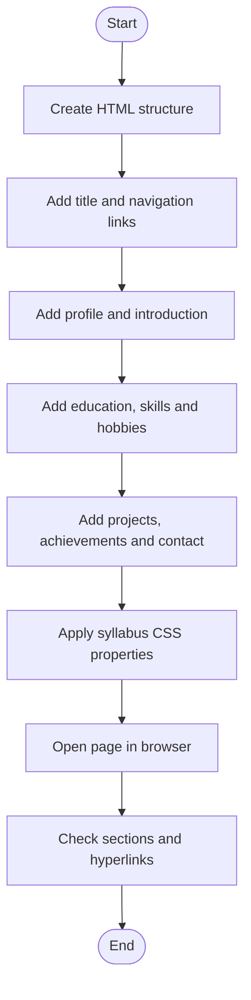

# Flowchart – Personal Portfolio Website

```mermaid
flowchart TD
 A([Start]) --> B[Create HTML structure]
 B --> C[Add title and navigation links]
 C --> D[Add profile and introduction]
 D --> E[Add education, skills and hobbies]
 E --> F[Add projects, achievements and contact]
 F --> G[Apply syllabus CSS properties]
 G --> H[Open page in browser]
 H --> I[Check sections and hyperlinks]
 I --> J([End])
```
