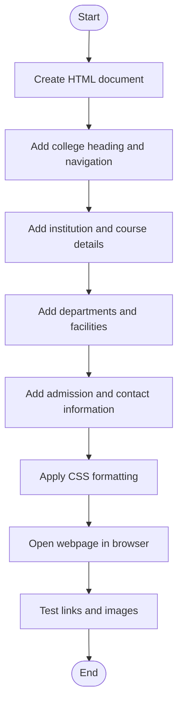

# Flowchart – College Information Website

```mermaid
flowchart TD
 A([Start]) --> B[Create HTML document]
 B --> C[Add college heading and navigation]
 C --> D[Add institution and course details]
 D --> E[Add departments and facilities]
 E --> F[Add admission and contact information]
 F --> G[Apply CSS formatting]
 G --> H[Open webpage in browser]
 H --> I[Test links and images]
 I --> J([End])
```
