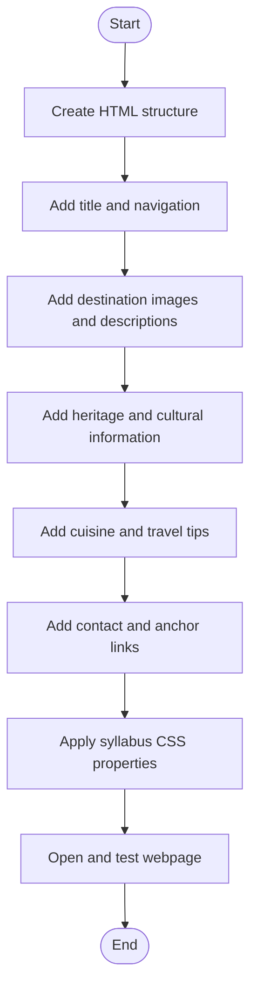

# Flowchart – Tourism and Heritage Website

```mermaid
flowchart TD
 A([Start]) --> B[Create HTML structure]
 B --> C[Add title and navigation]
 C --> D[Add destination images and descriptions]
 D --> E[Add heritage and cultural information]
 E --> F[Add cuisine and travel tips]
 F --> G[Add contact and anchor links]
 G --> H[Apply syllabus CSS properties]
 H --> I[Open and test webpage]
 I --> J([End])
```
